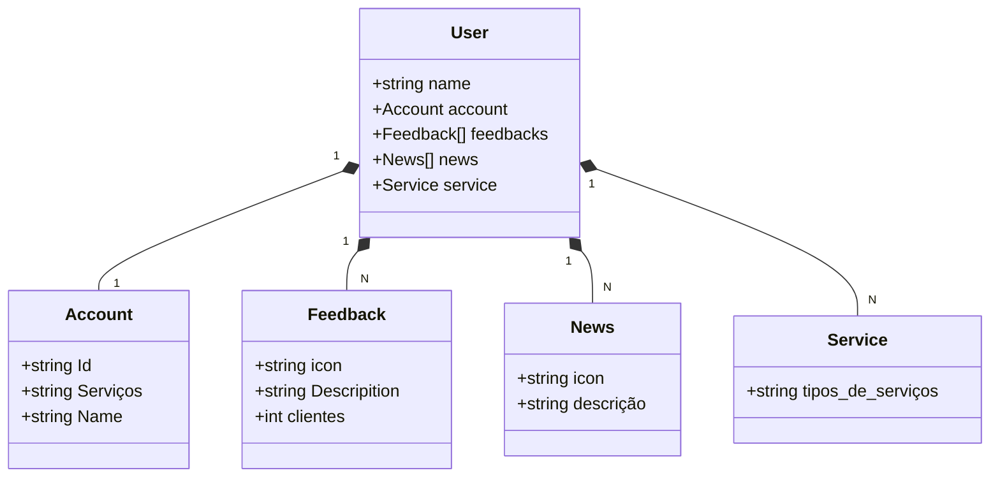

Projeto para o Bootcamp 2025 Avanade 

A ideia dessa tela seria a conta de um usuario de app de prestadores de serviços.

## Diagrama de classes

```mermaid

classDiagram
    class User {
        +string name
        +Account account
        +Feedback[] feedbacks
        +News[] news
        +Service service
    }
    
    class Account {
        +string Id
        +string Serviços
        +string Name
    }

    class Feedback {
        +string icon
        +string Descripition
        +int clientes
    }

    class News {
        +string icon
        +string descrição
    }

    class Service {
        +string tipos_de_serviços
    }

    User "1" *-- "1" Account
    User "1" *-- "N" Feedback
    User "1" *-- "N" News
    User "1" *-- "N" Service

```
